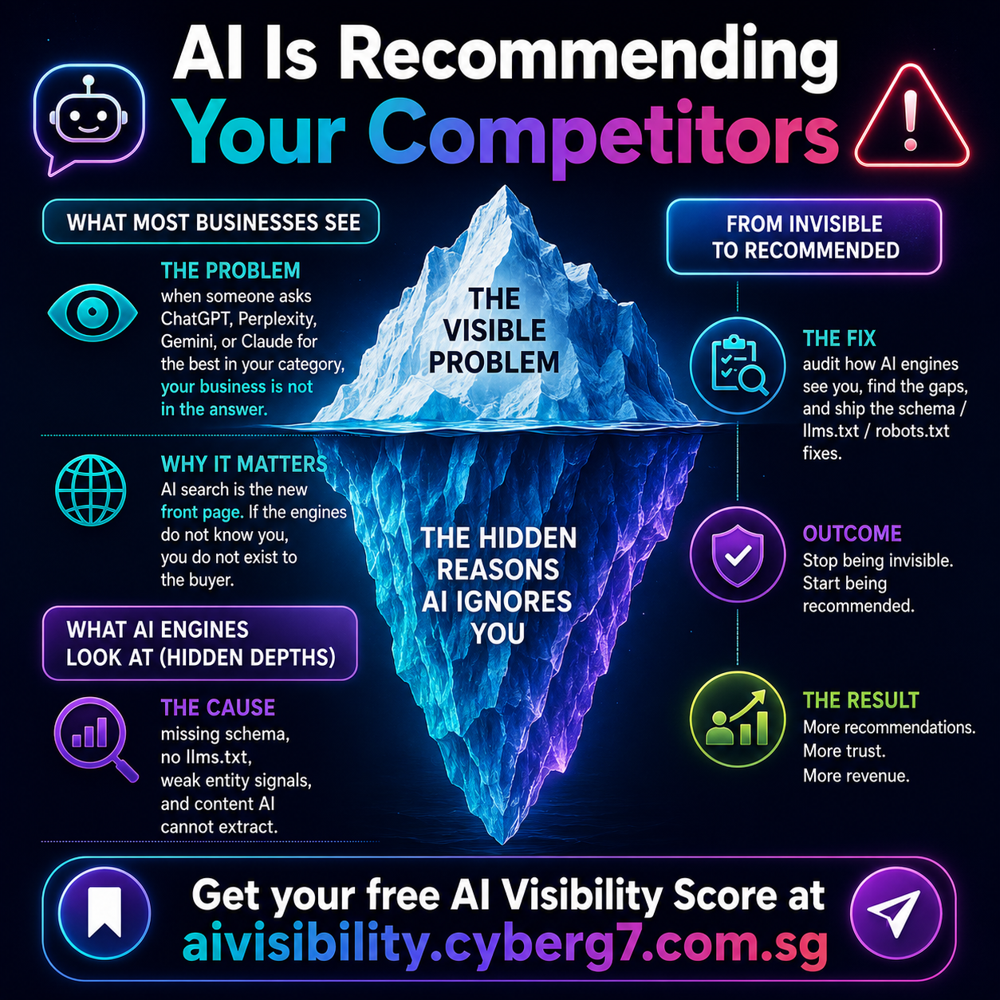
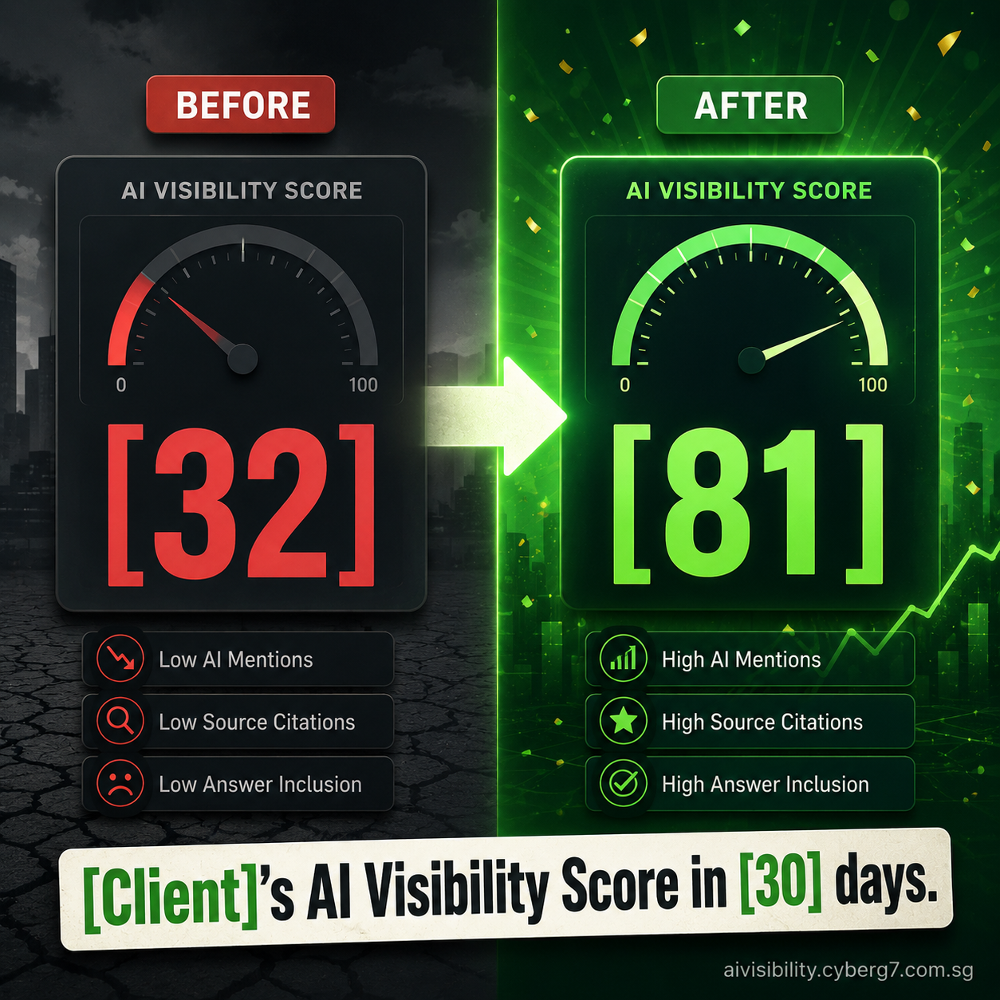
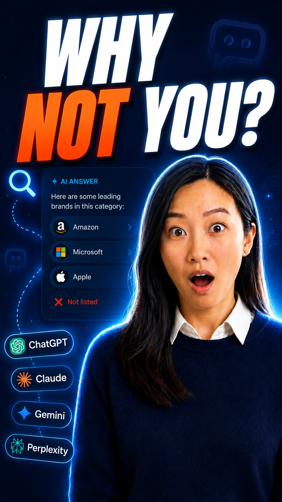
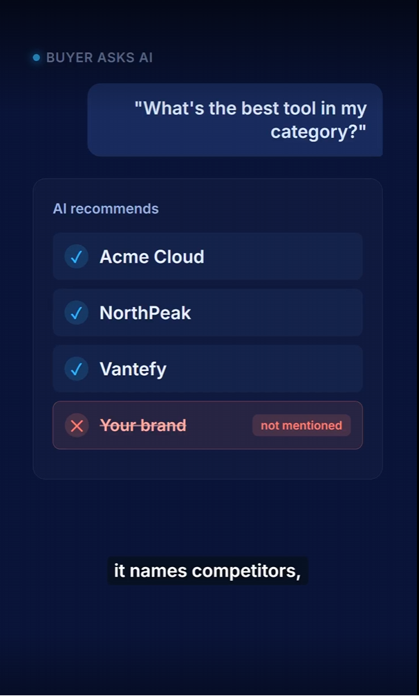
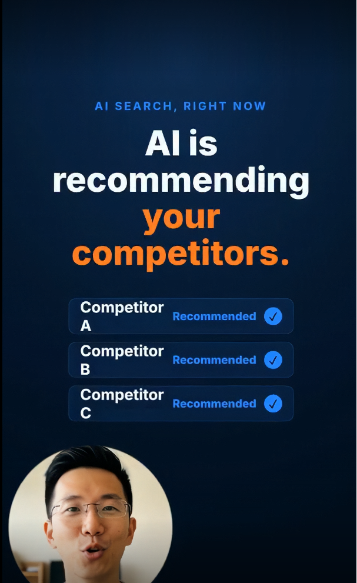
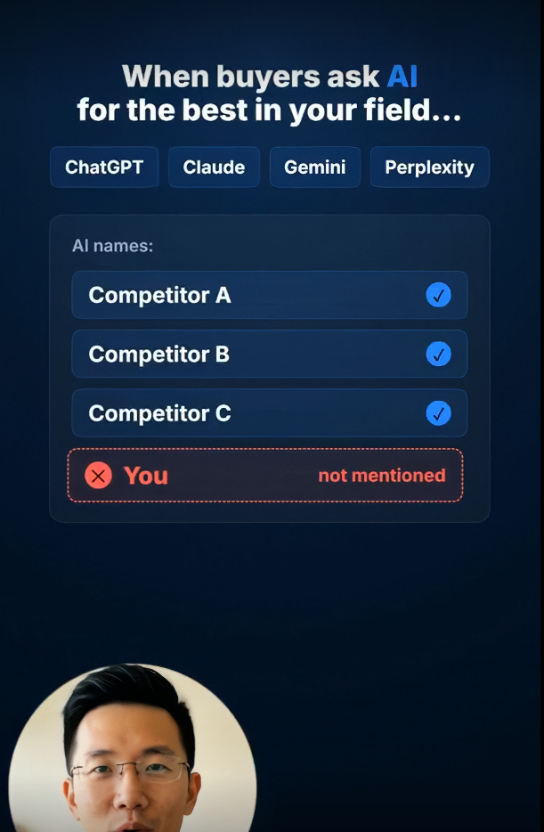
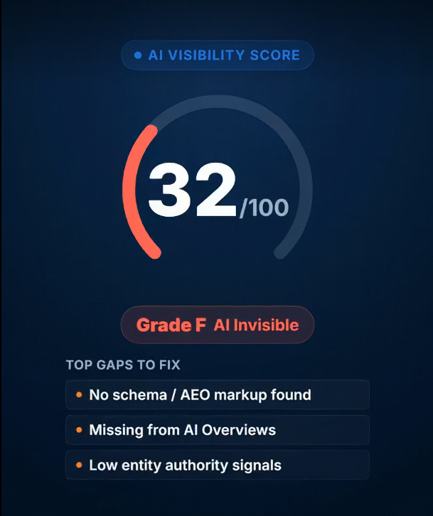

# 🎥 Video Generations

> **A two-pipeline production system for CyberG7's short-form vertical (9:16) videos.**
> HeyGen avatars + HyperFrames motion graphics + ffmpeg compositing, governed by locked
> rules so every render is reproducible and on-brand.


---

## TL;DR

**The problem.** Hand-producing social videos is slow and inconsistent — avatar, graphics,
captions, and timing drift from video to video, so the brand never looks the same twice.

**The solution.** A documentation-first **engine**: one locked doctrine (5-beat scripts,
fixed layer balance, transcription-driven captions, a mandatory branded outro) drives **two
pipelines** that share the same Marcus avatar and rendering tooling but target different
products. Rules live in version-controlled `RULES_*` files; rendering is a pinned HyperFrames
build + ffmpeg filter-graphs, so any operator (or agent) can reproduce a spec-perfect video.

**Why this approach**

| | Ad-hoc editing | This engine |
|---|---|---|
| Consistency | Eyeballed per video | Enforced by locked `RULES_*` + brand tokens |
| Repeatability | Re-learn each time | SOP + commands → same output on any machine |
| Captions | Estimated (drifts 1–2s) | Driven from a **real transcription** |
| Onboarding | Tribal knowledge | `START_HERE.md` index + per-pipeline guides |
| Brand identity | Per-video guesswork | One pinned renderer + mandatory outro |

---

## The two pipelines

Both use the same **HeyGen "Marcus"** avatar, the same 5-beat scripts, and the same
"avatar is the star" balance. They differ in product and output spec.

| | **AI Visibility** | **LaunchNow** |
|---|---|---|
| Product | Free AI-search visibility audit ([aivisibility.cyberg7.com.sg](https://aivisibility.cyberg7.com.sg)) | Website-builder offer (pro site in 7 days, S$288) |
| Topic | Whether ChatGPT / Claude / Gemini / Perplexity recommend you | Social content for the LaunchNow funnel |
| How it runs | Hands-on per video (`/ai-visibility-video` → script → build) | Command/SOP content engine in [`LaunchNow/`](LaunchNow/) (**no n8n**) |
| Also produces | Static 1:1 infographic posters (`/ai-visibility-infographics`) | Graphic-rich posters incl. device mockups (`/launchnow-infographics`) |
| Output | 1080×1920 · 30 fps · locked Montserrat captions | Matches the AV video spec (current engine) |

> ⚠️ The root `*_launchnow.md` files are the **legacy n8n pipeline, now superseded** by the
> command-driven engine in [`LaunchNow/`](LaunchNow/). Start at `LaunchNow/START_HERE.md`.

---

## Shared doctrine (the rules every video obeys)

- **Script** — 5 beats: Hook → Problem → Solution → Transformation → Result/CTA. **Never speaks the URL** (the link lives in the post caption).
- **Avatar** — HeyGen **Marcus** is the star (~**60%** of runtime); opens the hook and closes the CTA.
- **Graphics** — HyperFrames ~**25–30%**, used **only for data/comparison** beats (scores, leaderboards, pricing).
- **B-roll** — ~**10–15%**, max 3 per video, muted, overlaid on the VO.
- **Captions** — on **every** scene, timed from a **real transcription** (never estimated — estimation drifts and desyncs).
- **Outro** — the branded outro is **mandatory** on every export.

> The one rule that underpins all of it: **the human face sells; graphics serve the data and
> never crowd the face.**

---

## How a video is built

```
  /ai-visibility-video            HeyGen (web app)         HyperFrames (pinned)
  → 5-beat script  ───────►   Marcus avatar clip   +   data/comparison graphics
        │                       (1080×1920, VO)            (rendered to mp4)
        │                              │                          │
        ▼                              ▼                          ▼
   transcribe VO  ───────►   word-level timing drives captions + cutaway cuts
                                       │
                                       ▼
                         ffmpeg composite: avatar + graphics + muted B-roll
                          + burned captions + MANDATORY branded outro
                                       │
                                       ▼
                       /upload-to-drive → per-video Drive subfolder + links
```

---

## Tech stack

- **Python** — pipeline/automation scripts (the largest codebase here)
- **HyperFrames** `0.6.91` (pinned) — HTML/CSS/GSAP motion-graphics renderer
- **HTML + CSS** — graphic compositions and locked brand/subtitle tokens (`brand/aivisibility.css`, Montserrat 800)
- **ffmpeg** — the compositor: chroma-key/bubble masking, layer overlay, caption burn, outro append, AAC/H.264 `+faststart`
- **HeyGen** — avatar/voice generation (Marcus, 9:16, 1080p)
- **PowerShell** — machine-side helper scripts
- Requires **Node ≥ 18** + system **ffmpeg**

---

## Commands

| Command | Pipeline | Does |
|---|---|---|
| `/ai-visibility-video` | AI Visibility | Generate video angles / script ideas to spec |
| `/ai-visibility-infographics` | AI Visibility | Static 1:1 poster: prompt → generate → caption → schedule |
| `/upload-to-drive` | AI Visibility | Deliver video + thumbnail to Drive as a per-video subfolder + download links |
| `/launchnow-angles` | LaunchNow | This batch's candidate video angles |
| `/launchnow-infographics` | LaunchNow | Graphic-rich posters (incl. device mockups) |
| `/launchnow-upload-to-drive` | LaunchNow | Deliver LaunchNow assets to Drive |

---

## Engineering highlights

Representative of the depth in this repo (see [`handover.md`](handover.md) for a full worked example):

- **ffmpeg compositing under real constraints.** Keyed a dark-green (`#045304`) avatar without
  eating grey-shirt/black-hair pixels by moving from YUV `chromakey` to RGB `colorkey` + `despill`,
  then eroding + blurring the alpha to kill the white fringe — later swapped to a soft-edge **circular
  "Loom-style" bubble** mask via `geq` radial luma.
- **Transcription-driven sync.** Scene cuts and caption timing are derived from `silencedetect` +
  scene-change detection on the actual render, not estimated from the script — then freeze/trim frames
  are computed so on-screen cards land exactly on the spoken anchor ("Grade F" hits the 14/100 card).
- **Deterministic rendering.** HyperFrames is pinned to an exact version (not `^`) so every machine
  produces the same known-good build; bumps are deliberate and tested.
- **Operational guardrails.** Documented the HeyGen credit gotcha (the **API routes through Avatar IV
  and fails out-of-credit** — generate in the web app instead), so the pipeline never dead-ends.

---

## Repository structure

```
video-generations/
├── START_HERE.md                       # the index — read first
├── README.md                           # repo overview
├── GENERAL_dos_and_donts.md            # shared Do/Don't doctrine (both pipelines)
├── ACCOUNTS_AND_CONSTRAINTS.md         # accounts + limits (HeyGen, Drive, GHL)
├── MACHINE_MAP.md · TROUBLESHOOTING.md · SETUP.md
│
├── RULES_aivisibility.md               # AI Visibility — video rules of record (source of truth)
├── RULES_INFOGRAPHICS_aivisibility.md  # AI Visibility — poster rules of record
├── GUIDE_aivisibility.md · SOP_aivisibility.md · SOP_video_delivery.md
├── *_launchnow.md                      # ⚠ LEGACY n8n LaunchNow (superseded)
│
├── LaunchNow/                          # ⭐ CURRENT LaunchNow engine (command/SOP, no n8n)
│   ├── START_HERE.md · RULES_* · SOP_*
│   ├── commands/                       #   /launchnow-angles · -infographics · -upload-to-drive
│   ├── infographic-bot/                #   poster factory (device mockups)
│   ├── thumbnail-factory/              #   Marcus thumbnails
│   └── library/                        #   product research + poster catalog
│
├── commands/                           # /ai-visibility-video · -infographics · /upload-to-drive
├── brand/aivisibility.css              # LOCKED subtitle tokens (Montserrat 56px/800)
├── assets/                             # mandatory outro + gold-standard reference builds
├── thumbnail-factory/ · outro/ · docs/
├── video_delivery_flow.svg             # delivery flow diagram
└── package.json                        # pins hyperframes@0.6.91
```

---

## Getting started

```bash
git clone https://github.com/CyberG7-org/video-generations.git
cd video-generations
npm install            # fetches the pinned HyperFrames renderer (hyperframes@0.6.91)

npm run preview        # preview a HyperFrames composition in the browser
npm run render -- scene.html   # render a composition to mp4
```

**Also required:** Node ≥ 18, system `ffmpeg`, and a HeyGen account. Verify with `node -v` and
`ffmpeg -version`. Full prerequisites in [`SETUP.md`](SETUP.md); read
[`INSTALL_CLAUDE_SKILLS.md`](INSTALL_CLAUDE_SKILLS.md) before producing.

---

## Troubleshooting

| Symptom | Cause / Fix |
|---|---|
| HeyGen API render fails `OUT_OF_CREDIT` | API uses the premium Avatar IV engine → **generate in the web app** (`app.heygen.com`); web renders use plan credits fine. |
| Avatar has a white fringe / parts cut out | Dark-green key bleeds into hair/shirt → use RGB `colorkey` + `despill` + alpha erosion/blur (or the circle-bubble mask). |
| Captions / cards out of sync | Timing was estimated → re-transcribe and re-measure with `silencedetect`; recompute freeze/trim per the new read. |
| Render can't find assets | HyperFrames/ffmpeg run from the wrong folder → run from repo root; reference assets by relative path. |
| Inconsistent output across machines | HyperFrames version drift → keep it pinned (exact, not `^`); bump deliberately after testing. |

---

## Status & limitations

- The current **LaunchNow engine** (`LaunchNow/`) supersedes the root `*_launchnow.md` n8n docs — treat the latter as historical.
- `handover.md` documents one specific past AI Visibility promo (a ~27s circle-bubble composite) — a worked example, not the repo's interface.
- Project-specific to CyberG7's two offers; not a general-purpose video tool.
- Large binary cutouts (e.g. thumbnail factory) are gitignored — regenerate locally.

---

## Ownership

Internal **CyberG7** project — built and maintained by [@Cyberg7tech](https://github.com/Cyberg7tech).
All rights reserved. Not open for external contributions; issues and questions welcome.


## 📸 Screenshots
















